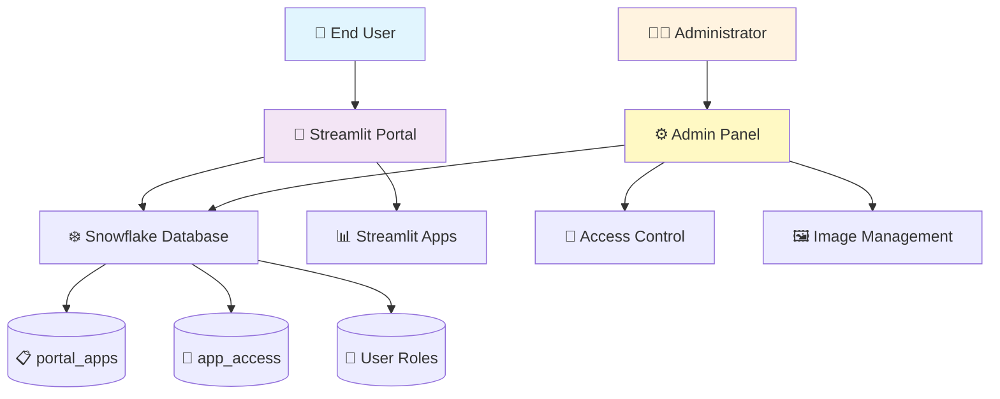

# 🚀 Streamlit Apps Portal
**Note**: This code is for demonstration purposes only and should be adapted for your specific use cases.

> **A beautiful, enterprise-ready portal for managing and launching Streamlit applications in Snowflake**

[](https://streamlit.io/)
[](https://snowflake.com/)
[](https://python.org/)

## 📑 Table of Contents
- [✨ Features](#-features)
- [🏗️ Architecture](#️-architecture)
- [🚀 Quick Start](#-quick-start)
- [📖 Usage](#-usage)
- [🔐 Security & Access Control](#-security--access-control)
- [🛠️ Configuration](#️-configuration)
- [📁 Project Structure](#-project-structure)
- [🤝 Support](#-support)

## ✨ Features

### 🎨 **Beautiful User Interface**
- **Responsive Grid Layout**: Modern card-based interface showing all your Streamlit apps
- **One-Click Launch**: Click any app to open it in a new tab
- **Custom App Images**: Upload and display custom images for each application
- **Clean Navigation**: Intuitive sidebar navigation with role-based menu items

### 🔐 **Enterprise Security**
- **Role-Based Access Control**: Leverages native Snowflake roles and users
- **Granular Permissions**: Control access at both user and role levels
- **Admin Panel**: Full administrative interface for managing apps and permissions
- **Secure by Default**: Only shows apps users have explicit access to

### ⚙️ **Administrative Power**
- **App Management**: Add/remove Streamlit applications from the portal
- **Access Control**: Grant permissions based on usernames or Snowflake roles
- **Usage Analytics**: View portal statistics and access patterns  
- **Image Management**: Upload and manage custom app icons
- **Real-time Updates**: Changes take effect immediately

### 🌐 **Multi-Environment Support**
- **Streamlit in Snowflake (SiS)**: Fully compatible with SiS environment
- **Standalone Streamlit**: Works in local/cloud Streamlit deployments
- **Unified Codebase**: Single application works in both environments

## 🏗️ Architecture



### 🔧 **Technical Stack**
| Component | Technology | Purpose |
|-----------|------------|---------|
| **Frontend** | Streamlit | Web interface and user experience |
| **Backend** | Snowpark Python | Database connectivity and queries |
| **Database** | Snowflake | Data storage and user management |
| **Authentication** | Snowflake Native | Secure user authentication |
| **Access Control** | Snowflake Roles | Permission management |
| **Image Storage** | Base64 in Database | App icon storage |

## 🚀 Quick Start

### 📋 **Prerequisites**
- ✅ Snowflake account with Streamlit enabled
- ✅ Python 3.8+ (for standalone deployment)
- ✅ Required Snowflake privileges for database/role creation

### ⚡ **Installation**

1. **Clone the Repository**
   ```bash
   git clone <repository-url>
   cd streamlit-apps-portal
   ```

2. **Set Up Database Schema**
   ```sql
   -- Run the setup script in Snowflake
   -- See setup_portal.sql for complete schema
   ```

3. **Deploy to Streamlit in Snowflake**
   ```sql
   CREATE STREAMLIT STREAMLIT_APPS_PORTAL
   ROOT_LOCATION = '@your_stage/portal'
   MAIN_FILE = 'StreamlitPortal.py'
   QUERY_WAREHOUSE = 'YOUR_WAREHOUSE';
   ```

4. **Grant Access to Administrators**
   ```sql
   GRANT ROLE StreamlitPortalAdmins TO USER your_admin_user;
   ```

### 🎉 **First Launch**
1. Navigate to your deployed Streamlit app
2. Log in with an admin account
3. Go to **Portal Configuration** → **Manage Applications**
4. Add your first Streamlit app to the portal
5. Set up access permissions
6. Switch to **Portal** view to see your app!

## 📖 Usage

### 👤 **For End Users**

| Action | Description |
|--------|-------------|
| **🏠 Browse Apps** | View all applications you have access to in a beautiful grid |
| **🚀 Launch Apps** | Click any app card or launch button to open in new tab |
| **📱 Mobile Access** | Fully responsive - works on phones and tablets |
| **🔍 Easy Navigation** | Clean, intuitive interface with sidebar navigation |

### 👨‍💼 **For Administrators**

| Feature | Location | Description |
|---------|----------|-------------|
| **📱 App Management** | Configuration → Manage Applications | Add/remove apps from portal |
| **🔐 Access Control** | Configuration → Manage Access | Set user/role permissions |
| **👥 Access Overview** | Configuration → Access Overview | View all permissions at a glance |
| **⚙️ Settings** | Configuration → Settings | Portal configuration and troubleshooting |
| **🖼️ Image Management** | Settings → Image Management | Upload custom app icons |
| **📊 Analytics** | Settings → Portal Statistics | View usage metrics |

## 🔐 Security & Access Control

### 🛡️ **Security Model**
- **Zero Trust**: Users only see apps they explicitly have access to
- **Native Authentication**: Uses Snowflake's built-in user management
- **Role Inheritance**: Leverages existing Snowflake role hierarchies
- **Audit Trail**: All access changes are logged with timestamps

### 👥 **Permission Types**

| Type | Icon | Description | Example |
|------|------|-------------|---------|
| **User Access** | 👤 | Direct user permission | `john.doe@company.com` |
| **Role Access** | 🔑 | Role-based permission | `DATA_ANALYST`, `MARKETING_TEAM` |
| **Public Access** | 🌐 | Available to all users | `PUBLIC` role |

### 🔧 **Administrative Roles**

| Role | Permissions |
|------|-------------|
| **StreamlitPortalAdmins** | Full portal administration |
| **AccountAdmin** | Full portal administration |
| **Standard Users** | Portal browsing only |

## 🛠️ Configuration

### 🗃️ **Database Objects**

```sql
-- Main application registry
portal_apps (
    app_id, app_name, app_title, description, 
    image_path, url_id, database_name, schema_name,
    is_active, created_at, updated_at
)

-- Access control matrix  
app_access (
    access_id, app_id, access_type, access_value, created_at
)
```

### ⚙️ **Environment Variables**
The portal automatically detects the environment (SiS vs Standalone) and adapts accordingly.

## 📁 Project Structure

```
streamlit-apps-portal/
│
├── 📄 StreamlitPortal.py          # Main portal application
├── 📄 portal_config.py            # Administrative interface
├── 📄 simple_image_manager.py     # Image upload functionality
├── 📄 setup_portal.sql            # Database setup script
├── 📄 requirements.txt            # Python dependencies
├── 📄 README.md                   # This file
└── 📄 requirements.md             # Original requirements document
```

## 🤝 Support

### 📚 **Documentation**
- **Setup Guide**: [Google Docs Setup Information](https://docs.google.com/document/d/1P5-YC5QnFuWzh1sD6NPNUQy2zgYilMcrRwBheQn9opg/edit?tab=t.0)
- **Built-in Help**: Access documentation directly in the portal
- **Troubleshooting**: Use the Settings → User Roles Troubleshooting tool

### 🐛 **Issue Reporting**
This is a personal project maintained on a best-effort basis. While there's no official support, issues and feedback are welcome!

### 🤝 **Contributing**
Contributions, suggestions, and feedback are welcome! This project is designed to be:
- **Extensible**: Easy to add new features
- **Maintainable**: Clean, documented code
- **Community-Driven**: Open to improvements and ideas

---

<div align="center">

**Made with ❤️ for the Streamlit and Snowflake communities**

[⭐ Star this repo](https://github.com/your-username/streamlit-apps-portal) • [🐛 Report Issues](https://github.com/your-username/streamlit-apps-portal/issues) • [💡 Request Features](https://github.com/your-username/streamlit-apps-portal/discussions)

</div>
